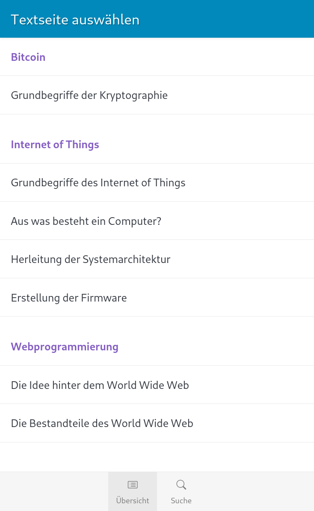
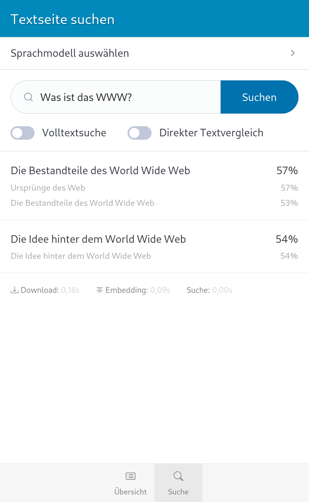
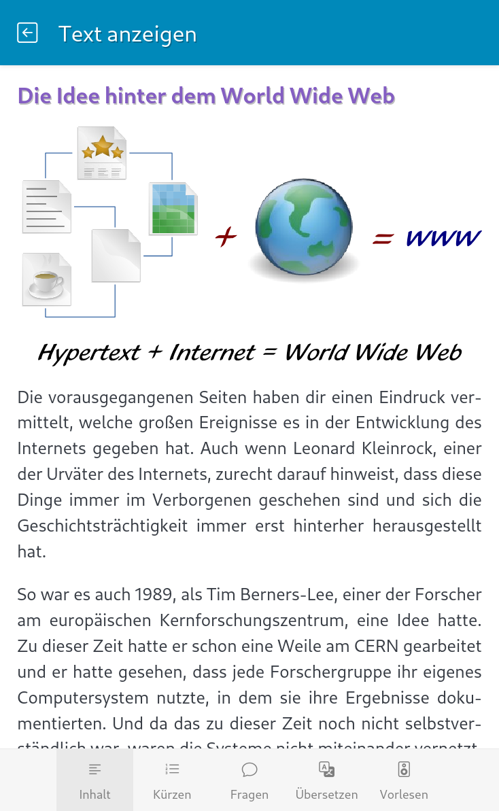

Web/Mobile-Test für lokale KI
=============================

1. [Beschreibung](#beschreibung)
1. [Vorbereitungen](#vorbereitungen)
1. [Start der Anwendung](#start-der-anwendung)
1. [Technische Umsetzung](#technische-umsetzung)
1. [Künftige Web APIs](#künftige-web-apis)
1. [Weitere Ideen](#weitere-ideen)
1. [Lessons Learned](#lessons-learned)
1. [Copyright](#copyright)

Beschreibung
------------

Dies ist ein Versuch, ob kleine KI-Sprachmodelle auch im Browser auf Mobilgeräten
mit akzeptabler Performance ausgeführt werden können. Natürlich können auf diese
Weise nur einfache Anwendungsfälle unterstützt werden, aber dafür funktionieren
sie (in einer Progressive Web App) auch 100% offline und lokal, so dass der
Datenschutz gewährt ist.

Folgende Anwendungsfälle sollen hier getestet werden:

1. Text zusammenfassen (Summarization)
1. Text übersetzen (Translation)
1. Fragen beantworten (Question Answertung)
1. Semantische Suche (Sentence Similarity)
1. Text vorlesen (Text to Speach)

<table>
    <tr>
        <td>
            
        </td>
        <td>
            
        </td>
        <td>
            
        </td>
    </tr>
</table>

Vorbereitungen
--------------

Bevor die Anwendung gestartet werden kann, müssen folgende Schritte ausgeführt werden:

1. **Modelle herunterladen:** Um ein realistisches Deployment-Szenario nachzustellen,
   lädt die Webanwendung die Modelle nicht vom HuggingFace Model Hub. Stattdessen werden
   die Modelle als Teil der Webanwendung gehostet. Hierfür müssen sie auf dem Webserver
   einmalig lokal heruntergeladen werden.

2. **Testdaten aufbereiten:** In Vorbereitung auf den nächsten Schritt werden hier
   Schlüsselwörter aus den Beispielseiten extrahiert und die Seiten in einzelne Sätze
   zerlegt. Als Schlüsselwörter werden der Einfachheit halber einfach alle Überschriften
   und mit Fettdruck oder Kursivschrift ausgezeichnete Textstellen verwendet. Dies
   ermöglicht es, im nächsten Schritt die Texteinbettungen für beides zu berechnen,
   um somit einen Index für die semantische Suche aufzubauen.

3. **Worteinbettungen berechnen:** Die semantische Suche basiert auf der klassischen
   Kosinus-Ähnlichkeit von Worteinbettungen. Während der Suche wird die Einbettung
   des Suchbegriffs berechnet und mit den Einbettungen der aus den Testdokumenten
   erzeugten Kontextblöcke verglichen. Siehe [Lessons Learned](#semantische-suche)
   unten. Da sich letztere nur ändern, wenn sich die Testdaten ändern, müssne sie
   vor Ausführung der App einmalig vorberechnet werden.

Alle drei Schritte können mit `npm run init` hintereinander ausgeführt werden.
Alterantiv können die Schritte einzeln ausgeführt werden:

1. `npm run init:download`: Modelle herunterladen
2. `npm run init:preprocess`: Testdaten aufbereiten
3. `npm run init:embeddings`: Worteinbettungen berechnen

Wann immer sich die Testdaten ändern, müssen die Schritte 2 und 3 ausgeführt werden.
Wenn sich die verwendeten Modelle ändern, müssen in die Schritte 1 und 3 ausgeführt werden.

Da die Daten für die clientseitigen Webanwendung nutzbar sein müssen, liegen die Ergebnisse
dieser Schritte im `static`-Verzeichnis, sind aber von der Git-Versionierung ausgeschlossen.

Start der Anwendung 
-------------------

Der Devserver kann mit `npm start` oder `npm run watch` gestartet werden. Die Anwendung
kann dann über http://localhost:8888 im Browser aufgerufen werden.

Für ein statisches Deployment, kann die Anwendung mit `npm run build` gebaut werden.
Die Inhalte des `static`-Verzeichnisses können dann auf einen Webserver geschoben werden.

Technische Umsetzung
--------------------

Die Umsetzung ist bewusst so minimal wie möglich gehalten, um nicht vom eigentlichen
Versuch abzulenken. Für die Weboberfläche kommen zum Einsatz:

* **Bundler:** [Esbuild](https://picocss.com/)
* **UI:** [Svelte](https://svelte.dev/)
* **Styling:** [Pico CSS](https://picocss.com/)
* **Icons:** [Bootstrap Icons](https://icons.getbootstrap.com/)

Für die KI kommen folgende Bibliotheken und Modelle zum Einsatz:

* **Runtime:** [transformers.js](https://huggingface.co/docs/transformers.js/index) (basiert auf [ONNX}(https://onnxruntime.ai/))
* **KI-Modelle:** Siehe [./static/models/index.json](static/models/index.json)

Künftige Web APIs
-----------------

Aktuell bietet der Web-Plattform noch keine nativen APIs für die lokale Ausführung
von Machine-Learning-Modellen. Dies könnte sich aber künftig ändern:

* W3C Web Machine Learning Group
    * [Webseite](https://webmachinelearning.github.io/)
    * [W3C-Seite](https://www.w3.org/groups/cg/webmachinelearning/)
    * [GitHub](github.com/webmachinelearning/)
* Vorgeschlagene APIs (Auswahl)
    * [Web Neural Network API](https://www.w3.org/TR/webnn/)
    * [Danymic AI Offloading Protocol](https://github.com/webmachinelearning/daop)
    * [Prompt API](https://github.com/webmachinelearning/prompt-api)
    * [Writing Assistance API](https://github.com/webmachinelearning/writing-assistance-apis)
    * [WebMPC](https://github.com/webmachinelearning/webmcp)

Weitere Ideen
-------------

Eventuell könnte es sinnvoll sein, ein besseres Modell für Zusammenfassungen zu verwenden.
[deutsche-telekom/mt5-small-sum-de-en-v1](https://huggingface.co/deutsche-telekom/mt5-small-sum-de-en-v1)
würde sich anbieten, müsste aber noch [in das ONXX-Format konvertiert](https://huggingface.co/spaces/onnx-community/convert-to-onnx) werden.

[shannondata/multilingual-e5-small](https://huggingface.co/shannondata/multilingual-e5-small) kann vermutlich
für Sentency Similarity und Question Answering verwendet werden.

Lessons Learned
---------------

### Web-Plattform

* `Uint8Array.fromBase64()` wird von der Android Webview noch nicht durchgängig unterstützt.
  Älteren Geräte, die seit einem Jahr keine Updates mehr erhalten haben (eine Pest im Android-Ökosystem!)
  fehlen die Base64-Methoden, so dass hier auf eine kompliziertere Implementierung ausgewichen
  werden muss.

### transformers.js und HuggingFace

* transformers.js benötigt die Modelle im ONNX-Format, da es sich um Grunde genommen um
  einen Wrapper um ONXX handelt.
  
* Um wirklich alle kompatiblem Modelle zu finden, muss man auf HuggingFace unter "Libraries"
  nach beidem getrennt suchen, da ONXX und transformers.js zwei Filtereinträge sind. Wählt man
  aber beide aus, erhält man nur Treffer, die auch beides in ihren Metadaten deklarieren.

* Die Modelle müssen eine feste Verzeichnisstruktur besitzen, um genutzt werden zu können:

    - `/config.json`
    - `onnx/model.onnx`
    - `onnx/model_{dtype}.onnx`

  Fehlt beispielsweise die `config.json`-Datei, wirft transformers.js beim Herunterladen
  des Modells einen Fehler.

* Nicht immer sieht man am Dateinamen der Modelle, welche Datenformate (`dtype`) unterstützt
  werden. Das Skript `bin/init/download.js` ruft daher die Funktion `ModelRegistry.get_available_dtypes()`
  auf, um die verfügbaren Datentypen abzurufen und zeigt diese auf der Konsole an.

* Manchmal unterstützen die Modell die deutsche Sprache, auch wenn dies in den Metadaten
  nicht explizit angegeben ist. Zum Beispiel [onnx-community/text_summarization-ONNX](https://huggingface.co/onnx-community/text_summarization-ONNX).

* Die Dokumentation von transformers.js ist teilweise unvollständig und fehlerhaft. Manche
  Funktionen wie Text2Audio werden nur im Code in Form von Kommentaren dokumentiert. Andere
  Module wie `utils/hub` sind zwar dokumentiert, werden aber nicht exportiert.

* transformers.js besitzt für viele Modelle, in der Dokumentation nicht erwähnte, feste
  Konfigurationen im Code. Die Hoffnung ist, dass andere Modelle trotzdem nutzbar sind.

### Semantische Suche

* Viele moderne Sprachmodelle besitzen einen Transformer-Encoder, der aus
  einem Eingabetext kontextabhängige Token-Repräsentationen erzeugt. Das wird z.
  B. über eine Feature-Extraction-Pipeline zugänglich gemacht. Allerdings
  eignen sich nicht alle Sprachmodelle bzw. deren Repräsentationen gleichermaßen
  für semantische Suche. Insbesondere sind die erzeugten Token-Repräsentationen
  nicht automatisch so trainiert, dass sich daraus durch einen einfachen
  Vektorenvergleich sinnvolle semantische Ähnlichkeiten ergeben.

* Sentence Transformer Modelle eignen sich besonders gut für semantische
  Suche, da sie speziell darauf trainiert wurden, semantisch ähnliche Texte im
  Embedding-Raum nahe beieinander abzubilden. Dazu werden entsprechende
  Trainingsverfahren und ein für den Vergleich geeigneter Embedding-Output
  verwendet.

* Füttert man einem Modell wie `sentence-transformers/all-MiniLM-L6-v2` einen
  einzelnen String, erhält man bei der Feature Extraction beispielsweise einen
  Tensor mit der Dimensionalität `(1, 15, 384)`. Dies bedeutet:

  * `1` Eingabestring
  * `15` Tokens (abhängig vom Eingabetext)
  * `384` Werte je Token (abhängig vom Modell)

* Im Beispiel besteht die Ausgabe also aus `1 × 15 × 384 = 5760` Werten. Um aus
  den unterschiedlich langen Sequenzen eine einheitliche Repräsentation des
  gesamten Strings zu erhalten, werden die Token-Embeddings mittels Mean
  Pooling zu einem Vektor mit 384 Werten zusammengefasst. Bei `all-MiniLM-L6-v2`
  ist dies die vorgesehene Vorgehensweise.

* Der eigentliche Vergleich zweier Embeddings kann über die Kosinus-Ähnlichkeit
  erfolgen. Sie entspricht geometrisch dem Kosinus des Winkels zwischen den beiden
  Vektoren und liegt im Wertebereich `[-1, 1]`:

  * `-1` → entgegengesetzte Richtungen (`180°`)
  * `0` → orthogonale Vektoren (`90°`)
  * `1` → gleiche Richtung (`0°`)

  Vgl. [Wikipedia: Kosinus-Ähnlichkeit](https://de.wikipedia.org/wiki/Kosinus-%C3%84hnlichkeit)  
  Vgl. [transformers.js: maths.cos_sim()](https://huggingface.co/docs/transformers.js/api/utils/maths#utilsmathscossimarr1-arr2--number)

* Werden die Vektoren zusätzlich auf Einheitslänge normalisiert, reduziert sich die Berechnung
  der Kosinus-Ähnlichkeit auf das Skalarprodukt der beiden Vektoren.

  Vgl. [transformers.js: maths.dot()](https://huggingface.co/docs/transformers.js/api/utils/maths#module_utils/maths.dot)

* Die Qualität der semantischen Suche hängt, wie zu erwarten, vom verwendeten Embedding
  Modell ab und ob dieses Synonyme für die verwendeten Begriffe kennt. Das kleine Modell
  `sentence-transformers/all-MiniLM-L6-v2` scheint zum Beispiel `WWW` und `World Wide Web`
  als Synonyme zu kennen, `IoT` und `Internet of Things` aber nicht. Dennoch sinkt die
  Trefferwahrscheinlichkeit deutlich, wenn man `WWW` sucht, im Text aber `World Wide Web`
  steht.

Copyright
---------

**Web/Mobile-Test für lokale KI**
**© 2026 Dennis Schulmeister-Zimolong <[dennis@wpvs.de](mailto:dennis@wpvs.de)>**  
[Quellcode Lizenziert unter BSD 3-Clause](.LICENCE)  
Beispieldaten lizenziert unter CC-BY 4.0, http://creativecommons.org/licenses/by/4.0/