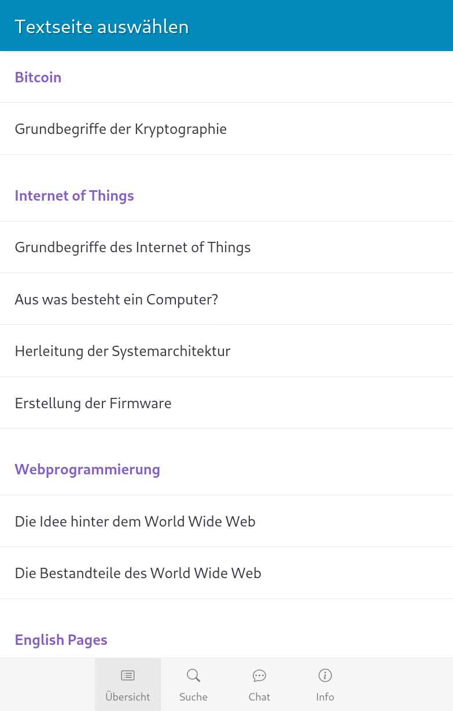
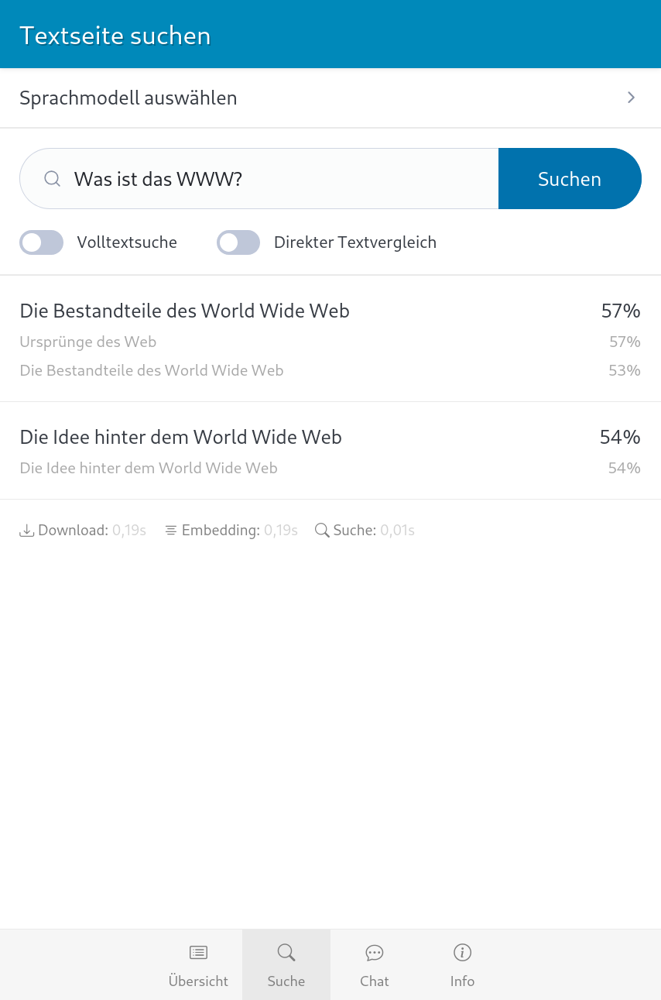
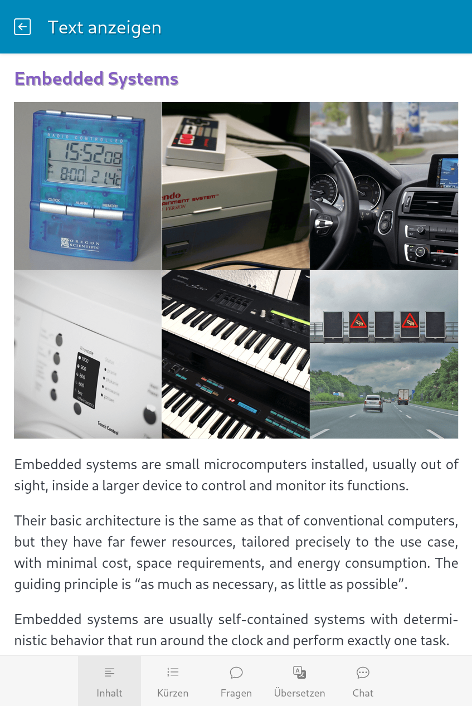
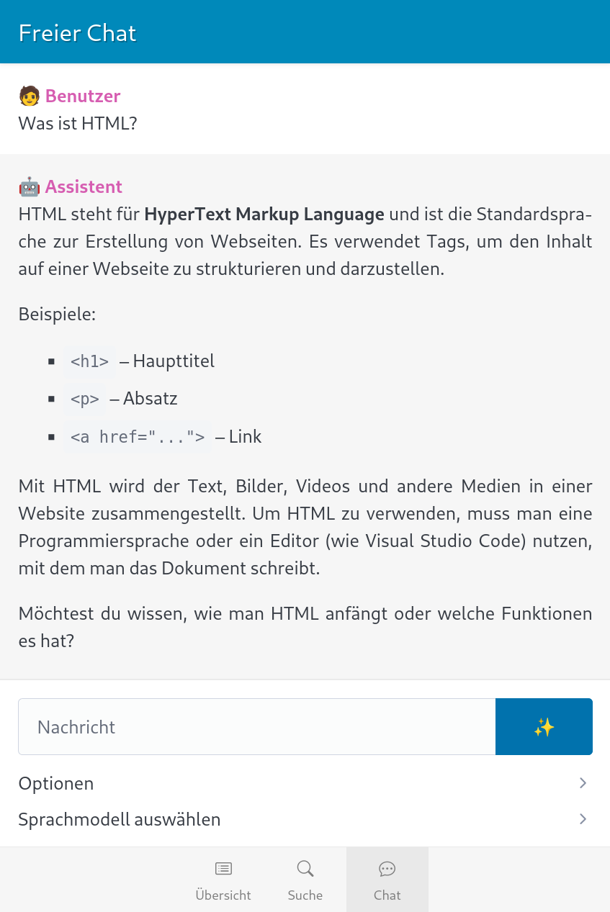
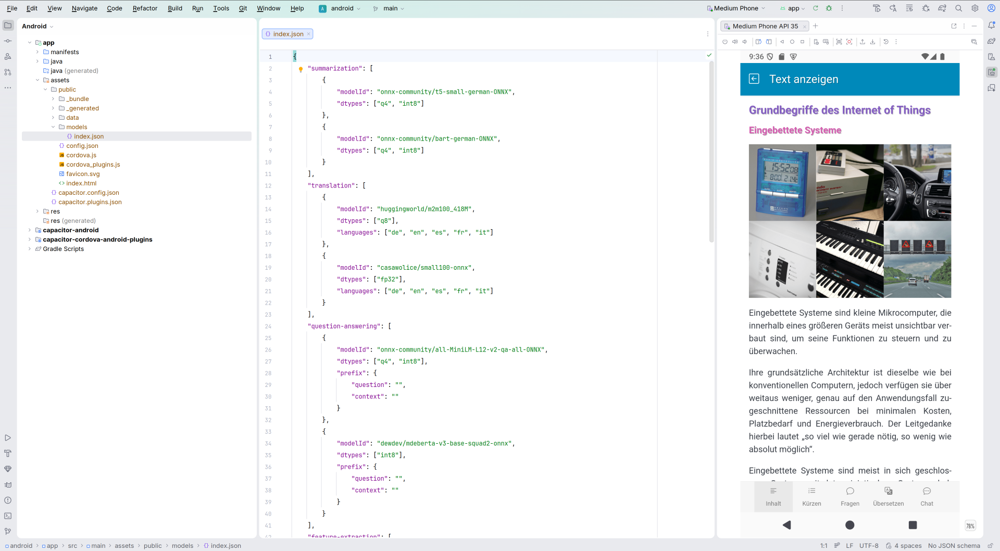

Web/Mobile-Test für lokale KI
=============================

1. [Beschreibung](#beschreibung)
1. [Vorbereitungen](#vorbereitungen)
1. [Start der Anwendung](#start-der-anwendung)
1. [Android App bauen](#android-app-bauen)
1. [Technische Umsetzung](#technische-umsetzung)
1. [Künftige Web APIs](#künftige-web-apis)
1. [Lessons Learned](#lessons-learned)
1. [Fazit](#fazit)
1. [Copyright](#copyright)

Beschreibung
------------

Dies ist ein Versuch, ob kleine KI-Sprachmodelle auch im Browser auf Mobilgeräten
mit akzeptabler Performance ausgeführt werden können. Natürlich können auf diese
Weise nur einfache Anwendungsfälle unterstützt werden, aber dafür funktionieren
sie (in einer Progressive Web App) auch 100% offline und lokal, so dass der
Datenschutz gewährt ist.

Folgende Anwendungsfälle sollen hier getestet werden:

1. Text zusammenfassen (Summarization)
1. Text übersetzen (Translation)
1. Fragen beantworten (Question Answering)
1. Semantische Suche (Sentence Similarity)
1. Chat (Text Generation / Text2Text Generation)

<table>
    <tr>
        <td>
            <a href="./doc/screenshot1.png">
                
            </a>
        </td>
        <td>
            <a href="./doc/screenshot2.png">
                
            </a>
        </td>
        <td>
            <a href="./doc/screenshot3.png">
                
            </a>
        </td>
        <td>
            <a href="./doc/screenshot4.png">
                
            </a>
        </td>
    </tr>
    <tr>
        <td colspan="4">
            <a href="./doc/android-studio.png">
                
            </a>
        </td>
    </tr>
</table>

Vorbereitungen
--------------

Bevor die Anwendung gestartet werden kann, müssen folgende Schritte ausgeführt werden:

1. **Modelle herunterladen:** Um ein realistisches Deployment-Szenario nachzustellen,
   lädt die Webanwendung die Modelle nicht vom HuggingFace Model Hub. Stattdessen werden
   die Modelle als Teil der Webanwendung gehostet. Hierfür müssen sie auf dem Webserver
   einmalig lokal heruntergeladen werden.

2. **Testdaten aufbereiten:** In Vorbereitung auf den nächsten Schritt werden hier
   Schlüsselwörter aus den Beispielseiten extrahiert und die Seiten in einzelne Sätze
   zerlegt. Als Schlüsselwörter werden der Einfachheit halber einfach alle Überschriften
   und mit Fettdruck oder Kursivschrift ausgezeichnete Textstellen verwendet. Dies
   ermöglicht es, im nächsten Schritt die Texteinbettungen für beides zu berechnen,
   um somit einen Index für die semantische Suche aufzubauen.

3. **Worteinbettungen berechnen:** Die semantische Suche basiert auf der klassischen
   Kosinus-Ähnlichkeit von Worteinbettungen. Während der Suche wird die Einbettung
   des Suchbegriffs berechnet und mit den Einbettungen der aus den Testdokumenten
   erzeugten Kontextblöcke verglichen. Siehe [Lessons Learned](#semantische-suche)
   unten. Da sich letztere nur ändern, wenn sich die Testdaten ändern, müssen sie
   vor Ausführung der App einmalig vorberechnet werden.

Alle drei Schritte können mit `npm run init` hintereinander ausgeführt werden.
Alternativ können die Schritte einzeln ausgeführt werden:

1. `npm run init:download`: Modelle herunterladen
2. `npm run init:preprocess`: Testdaten aufbereiten
3. `npm run init:embeddings`: Worteinbettungen berechnen

Wann immer sich die Testdaten ändern, müssen die Schritte 2 und 3 ausgeführt werden.
Wenn sich die verwendeten Modelle ändern, müssen in die Schritte 1 und 3 ausgeführt werden.

Da die Daten für die clientseitigen Webanwendung nutzbar sein müssen, liegen die Ergebnisse
dieser Schritte im `static`-Verzeichnis, sind aber von der Git-Versionierung ausgeschlossen.

Start der Anwendung
-------------------

Der Devserver kann mit `npm start` oder `npm run watch` gestartet werden. Die Anwendung
kann dann über http://localhost:8888 im Browser aufgerufen werden.

Für ein statisches Deployment, kann die Anwendung mit `npm run build` gebaut werden.
Die Inhalte des `static`-Verzeichnisses können dann auf einen Webserver geschoben werden.

Android App bauen
-----------------

Die Anwendung kann optional auch mit [Capacitor](https://capacitorjs.com/) als installierbares
APK-File für Android verpackt werden. Hierfür muss die Anwendung, wie oben beschrieben,
initialisiert und mindestens einemal während der lokalen Entwicklung gebaut worden sein.

Danach können die Quelldateien für Android mit folgendem Befehl aktualisiert werden. Dies
muss immer gemacht werden, wenn sie die Webquellen oder die Inhalte im `static/`-Verzeichnis
verändert werden.

```sh
npm run android:sync
```

Zum Bauen öffnet man am besten das Verzeichnis `android/` in Android Studio und wählt dort
_Build → Generate App Bundles or APKs_ zum Bauen der Anwendung.

Damit das APK nicht die Größenlimits des ZIP32-Formats überschreitet, bereitet `android:sync`
nach dem Web-Build ein separates Verzeichnis `.capacitor/www/` vor. Dieses ist in der Datei
`capacitor.config.ts` als `webDir` konfiguriert und enthält alle Web Assets, aber nur vorab
heruntergeladene Modelle, die in der Datei `static/models/index.json` mit
`"android": {"include": true}` gekennzeichnet wurden.

Die ausgewählten Modelle müssen vor dem Sync mit `npm run init:download` heruntergeladen worden
sein. Das Staging-Verzeichnis wird bei jedem Sync neu erstellt, damit keine veralteten Modelle
übernommen werden.

Fehlende Modelle werden in der Android-App vom HuggingFace Hub geladen. Um dies zu unterbinden
können in der Datei `static/config.json` die betroffenen Features deaktiviert werden.

Technische Umsetzung
--------------------

Die Umsetzung ist bewusst so minimal wie möglich gehalten, um nicht vom eigentlichen
Versuch abzulenken. Für die Weboberfläche kommen zum Einsatz:

* **Bundler:** [Esbuild](https://picocss.com/)
* **UI:** [Svelte](https://svelte.dev/)
* **Styling:** [Pico CSS](https://picocss.com/)
* **Icons:** [Bootstrap Icons](https://icons.getbootstrap.com/)

Für die KI kommen folgende Bibliotheken und Modelle zum Einsatz:

* **Runtime:** [transformers.js](https://huggingface.co/docs/transformers.js/index) (basiert auf [ONNX](https://onnxruntime.ai/))
* **KI-Modelle:** Siehe [./static/models/index.json](static/models/index.json)

Die Anwendung nutzt die high-level Pipeline API von transformers.js, da diese für jede
Modellart die typischen Verarbeitungsschritte kapselt. Bei Bedarf könnte aber auf die
low-lever `Model`/`Tokenizer`/…-Klassen gewechselt werden, durch Anpassung der Methode
`loadModel()` der Klasse `ModelState`.

Zusätzlich kann die App als Android App gepackt werden. Hierfür werden genutzt:

* **Capacitor:** https://capacitorjs.com/
* **Android SDK:** https://developer.android.com/

Künftige Web APIs
-----------------

Aktuell bietet der Web-Plattform noch keine nativen APIs für die lokale Ausführung
von Machine-Learning-Modellen. Dies könnte sich aber künftig ändern:

* __W3C Web Machine Learning Group__
  * [Webseite](https://webmachinelearning.github.io/)
  * [W3C-Seite](https://www.w3.org/groups/cg/webmachinelearning/)
  * [GitHub](github.com/webmachinelearning/)

* __Vorgeschlagene APIs (Auswahl)__
  * [Web Neural Network API](https://www.w3.org/TR/webnn/)
  * [Danymic AI Offloading Protocol](https://github.com/webmachinelearning/daop)
  * [Prompt API](https://github.com/webmachinelearning/prompt-api)
  * [Writing Assistance API](https://github.com/webmachinelearning/writing-assistance-apis)
  * [WebMPC](https://github.com/webmachinelearning/webmcp)

Lessons Learned
---------------

### Web-Plattform

* `Uint8Array.fromBase64()` wird von der Android Webview noch nicht durchgängig unterstützt.
  Älteren Geräte, die seit einem Jahr keine Updates mehr erhalten haben (eine Pest im Android-Ökosystem!)
  fehlen die Base64-Methoden, so dass hier auf eine kompliziertere Implementierung ausgewichen
  werden muss.

* Die Ausführung großer Modelle (bereits um die 300 MB) mit Web Assembly blockiert den Browser
  so sehr, dass diese währenddessen alle anderen Prozesse unterbricht. Vor allem findet kein
  Rendering statt. Deshalb scheint unsere Stoppuhr nicht zu laufen und auch die gestreamten
  Texte werden nicht angezeigt. Getestet mit Firefox Desktop und Chrome Desktop.

* Memory Preasure: Die Performance bricht drastisch ein, wenn ein Modell nicht vollständig in den
  RAM geladen werden kann und das Betriebssystem auf Swap Space ausweichen muss. Dies kann auch
  passieren, wenn man in einer Session zwischen mehreren Modellen wechselt.

* Manchmal kann es aber auch einfach vorkommen, dass der Browser nicht genügend Speicher
  allozieren kann: `Error: Can't create a session. ERROR_CODE: 6, ERROR_MESSAGE: std::bad_alloc`.

### Android

* Der Android Emulator stürzt ab, wenn die Capacitor-App das Qwen-Modell lädt (ca. 885,2 MB).

* WebGPU scheint im Android Emulator nicht zu funktionieren. Wird zwar erkannt, aber beim
  Laden eines Modells (SmolLM2) kommt die Meldung:
  
  ```text
  Error: no available backend found.
  ERR: [webgpu] Error: Failed to get GPU adapter.
  You may need to enable flag "--enable-unsafe-webgpu" if you are using Chrome.
  ```

  Interessanterweise kommt die Meldung auch beim Versuch, ein Modell für die CPU-Ausführung
  mit Web Assembly zu laden.

### transformers.js und HuggingFace

* transformers.js benötigt die Modelle im ONNX-Format, da es sich um Grunde genommen um
  einen Wrapper um ONNX handelt.
  
* Um wirklich alle kompatiblem Modelle zu finden, muss man auf HuggingFace unter "Libraries"
  nach beidem getrennt suchen, da ONNX und transformers.js zwei Filtereinträge sind. Wählt man
  aber beide aus, erhält man nur Treffer, die auch beides in ihren Metadaten deklarieren.

* Die Modelle müssen eine feste Verzeichnisstruktur besitzen, um genutzt werden zu können:

  * `/config.json`
  * `/tokenizer_config.json`
  * `onnx/model.onnx`
  * `onnx/model_{dtype}.onnx`

  Fehlt beispielsweise die `config.json`-Datei, wirft transformers.js beim Herunterladen
  des Modells einen Fehler.

* Nicht immer sieht man am Dateinamen der Modelle, welche Datenformate (`dtype`) unterstützt
  werden. Das Skript `bin/init/download.js` ruft daher die Funktion `ModelRegistry.get_available_dtypes()`
  auf, um die verfügbaren Datentypen abzurufen und zeigt diese auf der Konsole an.

* Manchmal unterstützen die Modelle die deutsche Sprache, auch wenn dies in den Metadaten
  nicht explizit angegeben ist. Zum Beispiel [onnx-community/text_summarization-ONNX](https://huggingface.co/onnx-community/text_summarization-ONNX).

* Allerdings scheinen Modelle für die deutsche Sprache insgesamt selten zu sein. Die allermeisten
  Modelle sind auf Englisch trainiert. Zum Beispiel: [Xenova/distilbart-xsum-12-1](https://huggingface.co/Xenova/distilbart-xsum-12-1)
  generiert bei einem deutschen Text nur Müll.

* transformers.js besitzt für viele Modelle, in der Dokumentation nicht erwähnte, feste
  Konfigurationen im Code. Die Hoffnung ist, dass andere Modelle trotzdem nutzbar sind.

* transformers.js Version 4.2.0, basierend auf ONNX Runtime 1.25+: Unter Web Assembly lassen
  sich damit nur Modelle vom Typ FP32 laden. Der Versuch, ein quantisiertes Modell zu laden
  schlägt mit „TransposeDQWeightsForMatMulNBits Missing required scale“ fehl, weil in ONNX ein
  Optimierungsdurchlauf eingeführt wurde, der bestimmte Skalierungstensoren in quantisierten
  Modellen erwartet, die ältere quantisierte Exporte nicht bereitstellen.

  Seit transformers.js 4.3.0 behoben: [GitHub Issue](https://github.com/huggingface/transformers.js/issues/1707#issuecomment-4684921369)

* Modelle, die noch nicht im ONNX-Format vorliegen, können mit folgendem Online-Tool automatisch
  konvertiert und auf HuggingFace hochgeladen werden. Gibt man keinen eigenen Write Token an,
  werden sie unter der Organisation `onnx-community` hochgeladen:

  [Space: Convert to ONNX](https://huggingface.co/spaces/onnx-community/convert-to-onnx)

* Firefox 156 / Linux / WebGPU scheint keine Ausgaben zu generieren.
  Ausnahme: Chat

### Semantische Suche

* Viele moderne Sprachmodelle besitzen einen Transformer-Encoder, der aus
  einem Eingabetext kontextabhängige Token-Repräsentationen erzeugt. Das wird z.
  B. über eine Feature-Extraction-Pipeline zugänglich gemacht. Allerdings
  eignen sich nicht alle Sprachmodelle bzw. deren Repräsentationen gleichermaßen
  für semantische Suche. Insbesondere sind die erzeugten Token-Repräsentationen
  nicht automatisch so trainiert, dass sich daraus durch einen einfachen
  Vektorenvergleich sinnvolle semantische Ähnlichkeiten ergeben.

* Sentence Transformer Modelle eignen sich besonders gut für semantische
  Suche, da sie speziell darauf trainiert wurden, semantisch ähnliche Texte im
  Embedding-Raum nahe beieinander abzubilden. Dazu werden entsprechende
  Trainingsverfahren und ein für den Vergleich geeigneter Embedding-Output
  verwendet.

* Füttert man einem Modell wie `sentence-transformers/all-MiniLM-L6-v2` einen
  einzelnen String, erhält man bei der Feature Extraction beispielsweise einen
  Tensor mit der Dimensionalität `(1, 15, 384)`. Dies bedeutet:

  * `1` Eingabestring
  * `15` Tokens (abhängig vom Eingabetext)
  * `384` Werte je Token (abhängig vom Modell)

* Im Beispiel besteht die Ausgabe also aus `1 × 15 × 384 = 5760` Werten. Um aus
  den unterschiedlich langen Sequenzen eine einheitliche Repräsentation des
  gesamten Strings zu erhalten, werden die Token-Embeddings mittels Mean
  Pooling zu einem Vektor mit 384 Werten zusammengefasst. Bei `all-MiniLM-L6-v2`
  ist dies die vorgesehene Vorgehensweise.

* Der eigentliche Vergleich zweier Embeddings kann über die Kosinus-Ähnlichkeit
  erfolgen. Sie entspricht geometrisch dem Kosinus des Winkels zwischen den beiden
  Vektoren und liegt im Wertebereich `[-1, 1]`:

  * `-1` → entgegengesetzte Richtungen (`180°`)
  * `0` → orthogonale Vektoren (`90°`)
  * `1` → gleiche Richtung (`0°`)

  Vgl. [Wikipedia: Kosinus-Ähnlichkeit](https://de.wikipedia.org/wiki/Kosinus-%C3%84hnlichkeit) <br>
  Vgl. [transformers.js: maths.cos_sim()](https://huggingface.co/docs/transformers.js/api/utils/maths#utilsmathscossimarr1-arr2--number)

* Werden die Vektoren zusätzlich auf Einheitslänge normalisiert, reduziert sich die Berechnung
  der Kosinus-Ähnlichkeit auf das Skalarprodukt der beiden Vektoren.

  Vgl. [transformers.js: maths.dot()](https://huggingface.co/docs/transformers.js/api/utils/maths#module_utils/maths.dot)

* Die Qualität der semantischen Suche hängt, wie zu erwarten, vom verwendeten Embedding
  Modell ab und ob dieses Synonyme für die verwendeten Begriffe kennt. Das kleine Modell
  `sentence-transformers/all-MiniLM-L6-v2` scheint zum Beispiel `WWW` und `World Wide Web`
  als Synonyme zu kennen, `IoT` und `Internet of Things` aber nicht. Dennoch sinkt die
  Trefferwahrscheinlichkeit deutlich, wenn man `WWW` sucht, im Text aber `World Wide Web`
  steht.

### Text zusammenfassen

* Die im ONNX-Format verfügbaren Modelle auf HuggingFace sind alle nur auf englischen
  Texten trainiert. Deutsche Texte werden daher wörtlich wiedergegeben und nach einer
  Festen länge abgebrochen.

* Lediglich [Shahm/bart-german](https://huggingface.co/Shahm/bart-german) scheint auf
  einem deutschen Datensatz trainiert zu sein. Das Repository hat aber nicht die von
  transformers.js erwartete Struktur.

* In anderen Formaten als ONNX gibt es zumindest eine kleine Auswahl.
  [deutsche-telekom/mt5-small-sum-de-en-v2](https://huggingface.co/deutsche-telekom/mt5-small-sum-de-en-v2)
  wurde für diesen Test ins ONNX-Format konvertiert. Die FP32-Variante ist aber 1,8 GB groß.

  * int8: ca. 1,4 GB. In Firefox Desktop crash der Tab beim Laden.

  * q4f16: ca. 600 MB. Lässt sich aber nicht laden.

    ```text
    Error: Can't create a session. ERROR_CODE: 1, ERROR_MESSAGE: Type Error: Type (tensor(float16)) of output arg (/block.0/layer.0/layer_norm/Cast_output_0) of node (/block.0/layer.0/layer_norm/Cast) does not match expected type (tensor(float)).
    ```

  * fp16: ca. 817 MB. Lässt sich mit derselben Fehlermeldung nicht laden

  * q4: ca. 1,1 GB. Lässt sich laden, aber die Datei `tokenizer_config.json` fehlt.
    Die Generierung bricht daher mit `TypeError: tokenizer is not a function` ab.

  Es sieht so aus, als ob die ONNX Runtime fp16 nicht unterstützt.

* [Shahm/t5-small-german](https://huggingface.co/Shahm/t5-small-german) konnte erfolgreich
  konvertiert und getestet werden. Die besonders kleinen q4 und bnb4-Varianten erzeugen
  allerdings keinen Text. Und die Zusammenfassungen sind dast immer nur einen Satz lang. 🙂

* Lässt man das Modell zu wenig Token erzeugen (zum Beispiel nur zehn), wird der Text
  abgeschnitten. Generell scheint das Modell darauf ausgelegt zu sein, eine Textstelle
  aus der Anfrage zu extrahieren.

* Generell scheint es keine guten deutschsprachigen Modelle zu geben, oder diese sind
  für die Nutzung im Browser zu groß (1,5 GB und mehr). Von daher ist "summarization"
  mit [Shahm/t5-small-german](https://huggingface.co/Shahm/t5-small-german) zwar machbar.
  Die Zusammenfassung ist aber zu kurz.
  
  [onnx-community/bart-german-ONNX](https://huggingface.co/Shahm/t5-small-german) liefert
  etwas längere Texte bis zu drei Sätze. Das ist immer noch zu kurz. Und das Modell streut
  unsinnige Artefakte (falsche Wortfetzen mit technischen Begriffen ohne Bezug zum Kontext)
  ein, die vermutlich in den Trainingsdaten enthalten waren. Dadurch wird die Lesbarkeit
  deutlich gestört.

* Beide Modelle scheinen auch nur den Anfang der Texte zu betrachten und geben diesen
  teilweise einfach wörtlich wieder.

### Fragen beantworten

* Die Modelle versuchen, eine einzelne Textpassage zu finden, die die gegebene
  Frage zu beantworten scheint. Diese wird nahezu wörtlich wiedergeben, auch wenn
  es sich dabei nur um Satzschnippsel handelt.

* Das kleine Modell [onnx-community/all-MiniLM-L12-v2-qa-all-ONNX](https://huggingface.co/onnx-community/all-MiniLM-L12-v2-qa-all-ONNX)
  schneidet relativ gut ab, liefert aber nur einen sehr kleinen Textausschnitt.
  Es scheint aber mit Umlauten und Groß-/Kleinschreibung probleme zu haben, da
  die Antworten grundsätzlich kleingeschrieben und ohne Umlaute sind.

* Das größere Modell [dewdev/mdeberta-v3-base-squad2-onnx](https://huggingface.co/dewdev/mdeberta-v3-base-squad2-onnx)
  liefert ungemein größere Antworten, diese passen aber oft nicht zur gestellten Frage.

### Text übersetzen

* [huggingworld/m2m100_418M](https://huggingface.co/huggingworld/m2m100_418M) generiert
  bei zu großer Eingabe nur Giberish. Gut funktioniert die Seite "Aus was besteht ein
  Computer?", auch wenn die Übersetzung nicht perfekt ist. Die anderen Seiten sind
  wohl zu groß. Es wiederholt sich immer dieselbe Anfangszeichenkette.

* Ähnlich scheint es sich beim etwas kleineren [casawolice/small100-onnx](https://huggingface.co/casawolice/small100-onnx)
  zu verhalten. Bei großen Texten liefert es teilweise gar keine Übersetzung oder nur sinnlose
  Zeichenketten. Bei kleinen Texten kommt eine Übersetzung, diese ist grammatikalisch aber
  falsch und enthält viele Rechtschreibfehler.

### Chat

* Es gibt im Wesentlichen zwei Arten von Dialogmodellen (Conversational Models), die
  mit unterschiedlichen Pipelines genutzt werden müssen:

  * T5-Style: [`text2text-generation`-Pipeline](https://huggingface.co/docs/transformers.js/main/en/api/pipelines?utm_source=chatgpt.com#module_pipelines.Text2TextGenerationPipeline)
  * GPT-Style (CasualLM): [`text-generation`-Pipeline](https://huggingface.co/docs/transformers.js/main/en/api/pipelines?utm_source=chatgpt.com#module_pipelines.TextGenerationPipeline)

* Die `text2text-generation`-Pipeline erwartet die Eingabenachricht einfals String,
  oder ein String-Array mit mehreren Nachrichten.

* Die `text-generation`-Pipeline kann alternativ `Chat`-Objekte, die den Nachrichten
  eine Rolle wie `system` oder `user` zuweisen, entgegennehmen:

  ```js
  const messages = [
      { role: 'system', content: 'You are a helpful assistant.' },
      { role: 'user', content: 'Write me a poem about Machine Learning.' },
  ];
  ```

* `Chat`-Objekte benötigen jedoch ein Chat-Template, um in die vom Modell erwartete Token-Struktur
  übersetzt zu werden. Aus der [Transformer-Dokumentation](https://huggingface.co/docs/transformers/main/en/chat_templating):

  ```text
  The critical insight needed to understand chat models is this: All causal
  LMs, whether chat-trained or not, continue a sequence of tokens. When causal
  LMs are trained, the training usually begins with “pre-training” on a huge
  corpus of text, which creates a “base” model. These base models are then
  often “fine-tuned” for chat, which means training them on data that is
  formatted as a sequence of messages. The chat is still just a sequence of
  tokens, though! The list of role and content dictionaries that you pass to a
  chat model get converted to a token sequence, often with control tokens like
  <|user|> or <|assistant|> or <|end_of_message|>, which allow the model to see
  the chat structure. There are many possible chat formats, and different
  models may use different formats or control tokens, even if they were
  fine-tuned from the same base model!
  ```

* Allerdings hängt es vom Modell ab, ob es "Instruction Tuned" ist und somit einen
  Chat-Struktur als Eingabe erwartet. Ist ein Modell nicht "Instruction Tuned",
  besitzt es auch kein Chat-Template und kann folglich nur mit einem einfachen
  String als Eingabe aufgerufen werden.

* [onnx-community/Qwen3-0.6B-ONNX](https://huggingface.co/onnx-community/Qwen3-0.6B-ONNX)
  und [LiquidAI/LFM2.5-1.2B-Instruct-ONNX](https://huggingface.co/LiquidAI/LFM2.5-1.2B-Instruct-ONNX)
  sprechen auch deutsch. Bei Qwen sind die Antworten auf deutsche Fragen aber inhaltlich
  wesentlich schlechter (redet Blödsinn) als auf englische Fragen. Bei LiquidAI vermutlich
  auch, die deutschen Antworten scheinen aber besser als bei Qwen zu sein. Die Antworten
  beider Modell sind (in allen Sprachen) ausführlicher als bei den anderen Modellen.

* Qwen scheint auch ganz gute Antworten mit Bezug auf eine Textseite als Kontext zu liefern.
  Erstes Token nach 0,8 Sekunden, 3,9 Tokens/Sekunde (auf meinem Laptop). Das Modell ist
  an Ansätzen auch mehrsprachig, produziert auf Deutsch aber nicht immer korrekte Grammatik.
  Insgesamt schneidet es von den getesteten Mini-LLM am besten ab.

* [onnx-community/SmolLM2-135M-Instruct-ONNX](https://huggingface.co/onnx-community/SmolLM2-135M-Instruct-ONNX)
  hat eine gute Geschwindigkeit. Das Modell ist auch sehr klein (ca. 200 MB).  Die Qualität
  der Antworten schwank stark, von gut bis mehr oder weniger Blödsinn.

* [Xenova/LaMini-Flan-T5-783M](https://huggingface.co/Xenova/LaMini-Flan-T5-783M) generiert
  sehr kurze Antworten. Dennoch ist es sehr langsam.

* [teapotai/teapotllm](https://huggingface.co/teapotai/teapotllm) ist eigentlich darauf trainiert,
  nur Fragen zu einem gegebenen Kontext zu beantworten. Die Frage muss dafür in einer eigenen
  Zeile, getrennt durch eine Leerzeile, unter dem Kontext stehen. Ohne Kontext antwortet das Modell
  aber aus seinem internen Wissen heraus, wenn auch noch kürzer als 
  [Xenova/LaMini-Flan-T5-783M](https://huggingface.co/Xenova/LaMini-Flan-T5-783M). Mit Kontext
  liefert es längere und bessere Antworten, in Summe aber trotzdem nicht befriedigend.

* Die getesteten `text2text-generation`-Modelle schneiden allesamt schlechter ab, als die
  LLM-artigen `text-generation`-Modelle. Die Antworten sind kurz (nur ein/zwei Sätze) und
  brauchen lange für die Generierung.

#### Testfall: "What is HTML?"

Um einen wiederholbaren Test zu erhalten, wird der Browser für jedes Modells neugestartet
und es wird nur die Chat-Seite für einen freien Chat ohne Kontext geöffnet und das Modell
geladen. Danach werden folgende Nachrichten eingegeben.

1. What is HTML?
2. What is CSS?
3. What is JavaScript?

Es wird nur die Performance gemessen, nicht die Qualität der Antwort. Die Parameter sind:

* Max Tokens: Unbegrenzt
* Temperator: 0,3
* Strafe für Widerholungen: 1,1
* Sampling: Aktiv
* Ausführung: WebGPU
* Quantisierung: q4

Hier die Messergebnisse, gemessen unter Fedora Linux mit Firefox 157 auf einem Lenovo E580
mit folgender Ausstattung: 4x Intel(R) Core(TM) i7-8550U CPU @ 1.80GHz (mit Hypethreading),
16 GB RAM, 2 GB GPU, Baujahr 2018.

| Art       | Modell                                    | Größe    | Frage | Tokens |Erstes Token | Tokens/Sek | Dauer  |
|-----------|-------------------------------------------|---------:|------:|-------:|------------:|-----------:|-------:|
| Text-Gen  | onnx-community/SmolLM2-135M-Instruct-ONNX | 175,6 MB |     1 |    323 |       0,31s |       8,79 | 37,06s |
|           |                                           |          |     2 |    351 |       0,23s |       9,25 | 38,16s |
|           |                                           |          |     3 |    312 |       0,21s |       8,69 | 36,12s |
|           | onnx-community/Qwen3-0.6B-ONNX            | 885,2 MB |     1 |    116 |       0,45s |       9,94 | 12,12s |
|           |                                           |          |     2 |    103 |       0,38s |       9,47 | 11,27s |
|           |                                           |          |     3 |    254 |       0,47s |       9,91 | 25,81s |
|           | LiquidAI/LFM2.5-1.2B-Instruct-ONNX        | 814,0 MB |     1 |    114 |       0,83s |       7,65 | 15,74s |
|           |                                           |          |     2 |    147 |       0,73s |       9,35 | 16,46s |
|           |                                           |          |     3 |    173 |       0,73s |       9,69 | 18,58s |
| Text2Text | Xenova/LaMini-Flan-T5-783M                | 702,6 MB |     1 |     25 |       1,02s |       2,52 | 10,94s |
|           |                                           |          |     2 |     49 |       0,86s |       2,52 | 20,30s |
|           |                                           |          |     3 |     20 |       0,95s |       2,47 |  9,06s |
|           | teapotai/teapotllm                        | 702,7 MB |     1 |     20 |       0,94s |       2,46 |  9,05s |
|           |                                           |          |     2 |     25 |       0,93s |       2,60 | 10,54s |
|           |                                           |          |     3 |     18 |       0,76s |       2,49 |  7,99s |

#### Testfall: Text zusammenfassen

Gleiche Testbedingungen wie oben. Es wird jedoch die Seite "English / Internet of Things"
geöffnet. Die Anfrage an das Modell lautet: „Please summarize.”

| Art       | Modell                                    | Tokens |Erstes Token | Tokens/Sek | Dauer  |
|-----------|-------------------------------------------|-------:|------------:|-----------:|-------:|
| Text-Gen  | onnx-community/SmolLM2-135M-Instruct-ONNX |    204 |       1,14s |       8,71 | 24,57s |
|           | onnx-community/Qwen3-0.6B-ONNX            |     91 |       2,71s |       5,93 | 18,07s |
|           | LiquidAI/LFM2.5-1.2B-Instruct-ONNX        |     97 |       7,30s |       6,74 | 21,69s |
| Text2Text | Xenova/LaMini-Flan-T5-783M                |     29 |       2,16s |       2,33 | 14,61s |
|           | teapotai/teapotllm                        |     82 |       2,00s |       2,38 | 36,44s |

### Alle Modelle

Anders als bei den meisten LLMs, sind die hier verwendeten kleinen Modelle nicht gut darin,
Markdown-Syntax zu verarbeiten oder zu erzeugen. Von den getesteten LLM kommen alle damit
zurecht, außer [teapotai/teapotllm](https://huggingface.co/teapotai/teapotllm)

Die Modelle lassen sich in drei Grundarchitekturen einordnen, gemäß untenstehender Tabelle.

| Modellarchitektur         | High-Level Pipelines                                   | Low-Level AutoModel           |
|---------------------------|--------------------------------------------------------|-------------------------------|
| Encoder-only              | z.B. `feature-extraction`, `text-classification`       | `AutoModel` / task-spezifisch |
| Encoder-decoder / Seq2Seq | `text2text-generation`, `translation`, `summarization` | `AutoModelForSeq2SeqLM`       |
| Decoder-only / Causal LM  | `text-generation`                                      | `AutoModelForCausalLM`        |

Die Performance eines Modells hängt nicht nur von seiner Größe. Entscheidend ist auch,
ob das Modell (bzw. dessen ONNX-Export) effizient auf der GPU ausgeführt werden kann,
wie die folgende Tabelle zeigt:

| Modell                                    | Größe (q4) | Tokens/Sec |
|-------------------------------------------|-----------:|-----------:|
| onnx-community/SmolLM2-135M-Instruct-ONNX |   175,6 MB |     ~ 8,91 |
| onnx-community/Qwen3-0.6B-ONNX            |   885,2 MB |     ~ 9,80 |
| BananaMind/BananaMind-2-Medium-Chat-ONNX  |    54,9 MB |     ~ 0,80 |

Obwohl Qwen das größte Modell ist, läuft es schnellsten, da es im Vergleich zui SmolLM2
eine sehr optimierte Architektur besitzt: Weniger Nodes und auch höherwertige Nodes, die
in einem Schritt komplexe Berechnungen bündeln.

Das Problem bei BananaMind ist, dass es nach jedem Attention Layer explizite `IsNaN`-Prüfungen
enthält, welche die ONNX-Runtime nur auf der CPU ausführen kann. Das heißt, nach jedem Attention
Layer gibt es explizite Datentransfers von GPU nach CPU und wieder zurück. Diese verbrauchen
wesentlich mehr Zeit als die restlichen Berechnungen auf der GPU. Mit WASM ausgeführt, steigt
die Leistung auf ca. 6,3 Token/Sekunden. Der Browser friert dabei aber komplett ein (wie bei
allen auf WASM ausgeführten Modellen).

Zahlen ermittelt mit den Debug Logs beim Laden der Modell und Copilot. Die Logs liegen unter
`logs/**/debug-loading.log`. Getestet mit Firefox 157 unter Fedora Linux.

| Graph-Knoten              | SmolLM2 | Qwen3 | BananaMind |
|---------------------------|--------:|------:|-----------:|
| Transformer Layer         |      30 |    28 |         12 |
| Knoten Gesamt             |    2668 |   376 |       1646 |
| WebGPU-Knoten             |    1987 |   369 |       1027 |
| CPU-Knoten                |     681 |     7 |        619 |
| CPU → GPU Datentransfer   |       5 |     2 |         28 |
| GPU → CPU Datentransfer   |       0 |     0 |         13 |
| CPU IsNaN-Knoten          |       0 |     0 |         12 |
| Fused attention Knoten    |       0 |    28 |          0 |

Fazit
-----

Kleinere Anwendungsfälle, die mit Modellen zwischen 300 und 500 MB auskommen, lassen sich
auf mobilen Geräten innerhalb einer Webawendung lokal ausführen. Allerdings mit Einschränkungen:

* Das Ökosystem entwickelt sich schnell weiter. Aber in Folge daraus, ist es auch nicht
  immer stabil, was die durch ONNX 1.25 ausgelösten Fehlermeldungen zeigen, die monatelang
  in Transformers.js nicht gefixt wurden.

* Es funktioniert nicht mit jedem Browser. Chrome Mobile hat bisher am besten funktioniert.
  Firefox Mobile am schlechtesten (Abstürze, keine WASM SIMD-Unterstützen auf älteren Geräten, ... ).

* Unter Desktop Linux ist es aktuell genau andersrum: Firefox 155+ schneidet wesentlich
  besser ab als Chromium 154, da WebGPU nahezu vollständig unterstützt wird. In Chromium
  muss der WebGPU-Support aktuell noch unter [chrome://flags](chrome://flags) `Unsafe WebGPU Support`
  aktiviert werden. Die Performance ist aber unterirdisch (nur 0,2 Token/Sekunde im Verlgleich
  zui 9 Token/Sekunde unter Firefox).

* Speicher ist sehr knapp. Mehrere Modelle können daher nicht praktikabel im Speicher
  gehalten werden, sondern die Modelle regelmäßig neu geladen werden. Neben der Wartezeit
  erhöht dies auch den Traffic.

* WASM: Der Browser friert ein, während ein Modell ausgeführt wird. Es findet kein Rendering
  und somit auch keine Aktualisierung der Anzeige statt, während ein Modell läuft.
  Die Ausführung auf der CPU macht daher nur bei sehr kleinen Modelle, wie z.B. bei der
  semantische Suche Sinn.

* Die getesteten, kleinen Modelle für spezielle Anwendungen (Übersetzung, Zusammenfassung,
  Fragen beantworten) sind vergleichsweise langsam und liefern keine befriedigenden
  Ergebnisse. Die getesteten kleinen LLM waren hier sowohl schneller aus auch besser.

* Fine Tuning oder die Entwicklung eigener Modelle wären die nächsten logischen Schritte,
  um kleine Modelle für spezialisierte Anforderungen zu erstellen. Das Ziel müsste vermutlich
  sein, ein mittelgroßes LLM (17B bis 33B) so abzuspecken, dass aus auf dem Device laufen
  könnte, um halbwegs zufriedenstellende Ergebnisse zu liefern. In absehbarer Zeit ist das
  für mobile Endgeräte und die Ausführung im Web-Browser eher unwahrscheinlich.

* Interessante Ansätze in diese Richtung könnten 1,5bit-Modelle sein, da sie deutlich
  kompakter als die herkömmlichen Modelle sind, z.B.
  [Bonsai-27B-mlx-1bit](https://huggingface.co/prism-ml/Bonsai-27B-mlx-1bit)

* Generell sind die kleineren, offenen Modelle in der großen Mehrzahl auf englisch
  trainiert. Explizit deutschsprachige Modelle sind selten und die Qualität ist auch
  nicht sehr hoch.

Copyright
---------

**Web/Mobile-Test für lokale KI** <br>
© 2026 Dennis Schulmeister-Zimolong <[dennis@wpvs.de](mailto:dennis@wpvs.de)> <br>
[Quellcode Lizenziert unter BSD 3-Clause](.LICENCE) <br>
Beispieldaten lizenziert unter CC-BY 4.0, http://creativecommons.org/licenses/by/4.0/
