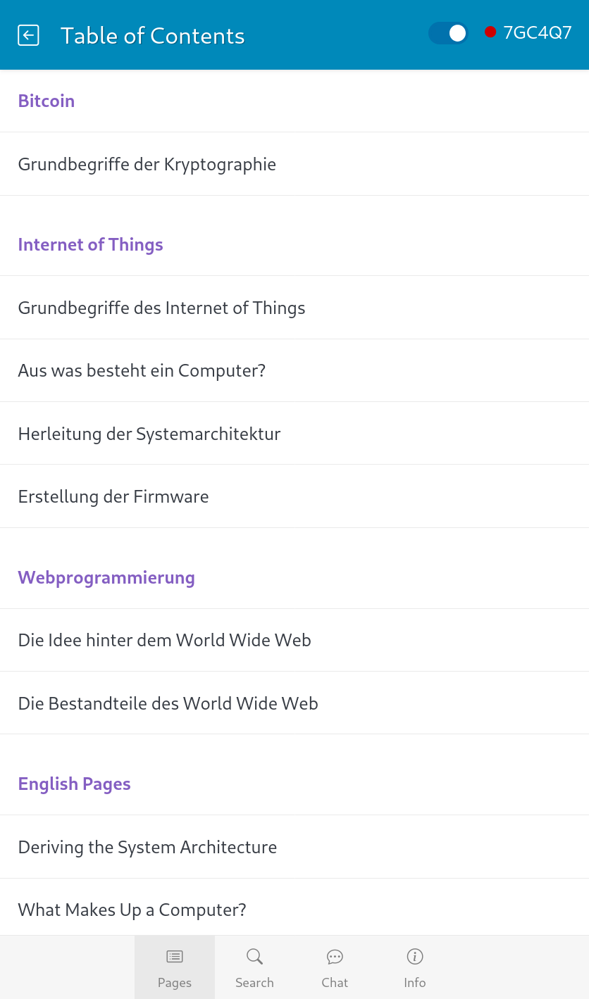
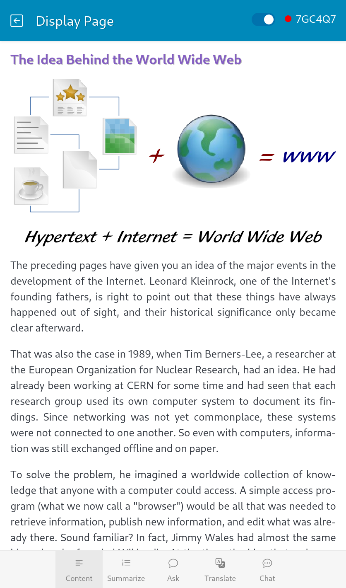
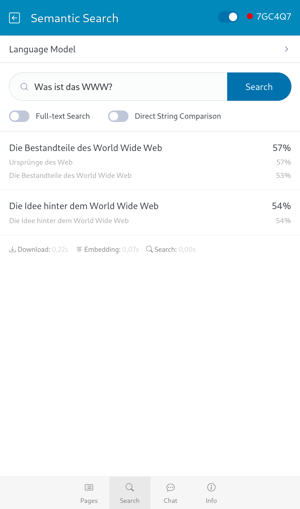
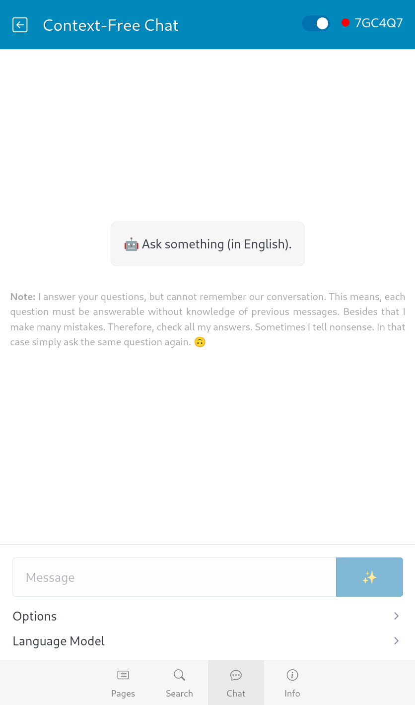
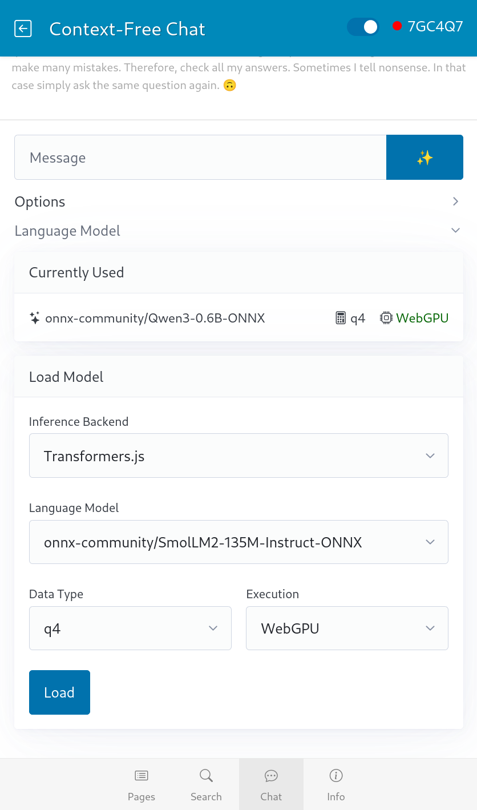
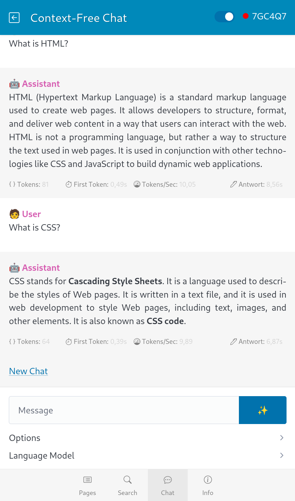
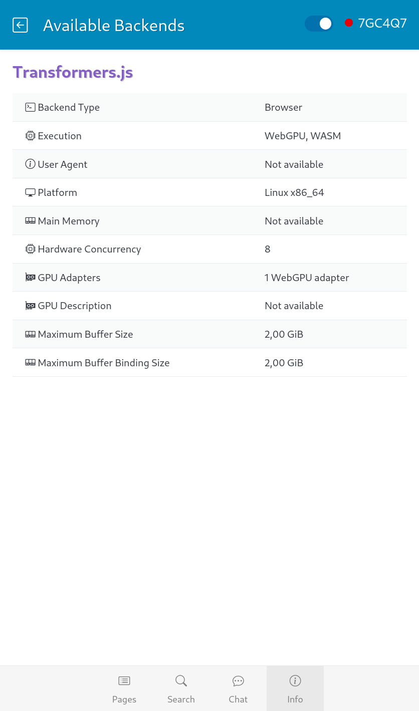
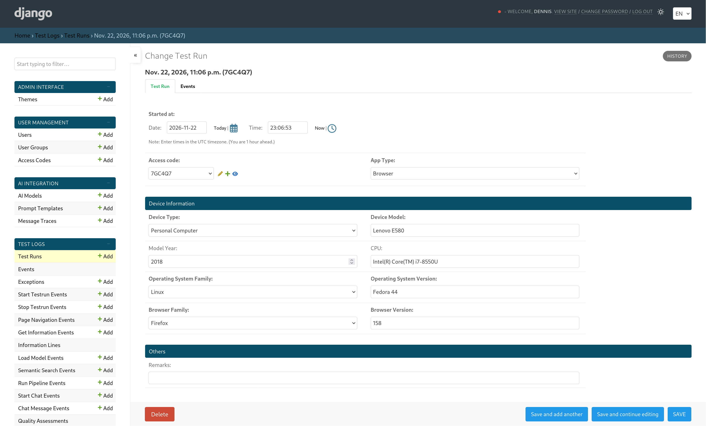
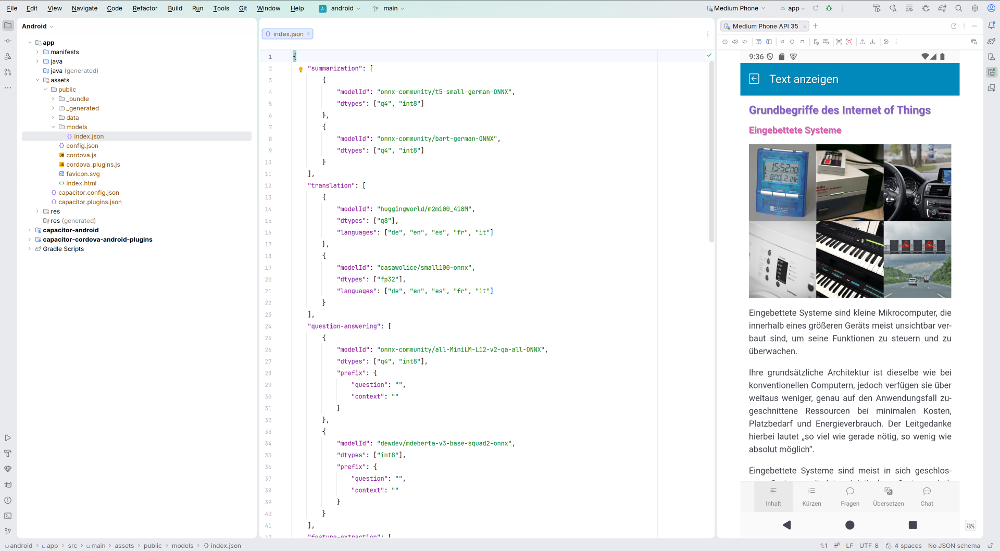

# Web/Mobile Test for Local AI

This project explores whether small AI language models can run locally in a web
application on mobile devices with acceptable performance. The prototype supports
summarization, translation, question answering, semantic search, and chat. Running
models locally can keep these interactions offline and their data on the device.

The repository contains:

* A Svelte web application in [`app/`](app/)
* An optional Capacitor Android application in [`android/`](android/)
* A Django backend for recording test cases in [`server/`](server/)
* Docker Compose deployment configuration in [`compose.yaml`](compose.yaml)
* Model and test data preparation scripts in `app/bin/`

## Documentation

### Build and run

* [Build and run the web app](doc/web-app.md)
* [Build and run the Capacitor Android app](doc/android-app.md)
* [Build and run the Django backend](doc/django-backend.md)
* [Docker Compose deployment](doc/docker-compose.md)

### Findings and tests

* [Platform learnings](doc/platform-learnings.md)
* [AI model and use-case learnings](doc/model-learnings.md)
* [Initial test results](doc/initial-test-results.md)
* [Test plan](doc/test-plan.md)

## Screenshots

<!-- Note: Screenshot size in Firefox responsive mode: 530x900 -->
<table>
    <tr>
        <td></td>
        <td></td>
        <td></td>
        <td></td>
    </tr>
    <tr>
        <td></td>
        <td></td>
        <td></td>
        <td></td>
    </tr>
    <tr>
        <td colspan="2"></td>
        <td colspan="2"></td>
    </tr>
</table>

## Copyright

**Web/Mobile Test for Local AI**

© 2026 Dennis Schulmeister-Zimolong <[dennis@wpvs.de](mailto:dennis@wpvs.de)>  
[Source code licensed under BSD 3-Clause](LICENSE)   
Example data licensed under [CC-BY 4.0](http://creativecommons.org/licenses/by/4.0/).
