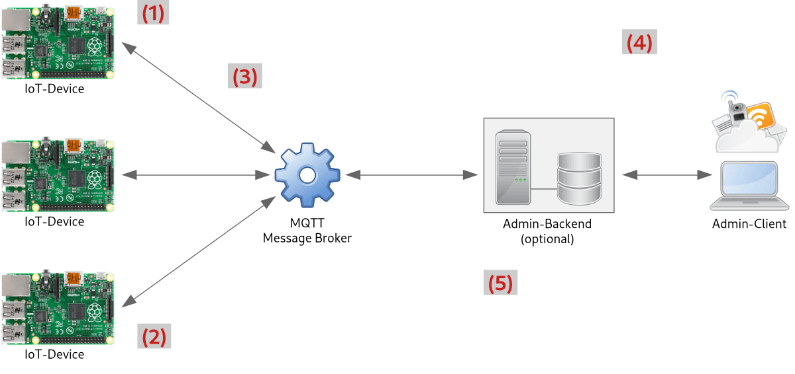

Deriving the System Architecture
================================

The following diagram shows the intended system architecture for our IoT use case:

1) The task is to implement an IoT use case based on the Raspberry Pi.

2) To do this, we need a scalable architecture that can accommodate any number of devices.

3) We therefore use an MQTT broker as the central component for message exchange using the publish/subscribe pattern.

4) Commercial IoT systems often also provide the ability to monitor and control devices remotely.

5) If the resulting data needs to be stored permanently and analyzed later, a custom server component is also required. Clients could then access only the backend server, or additionally access the devices via MQTT.
