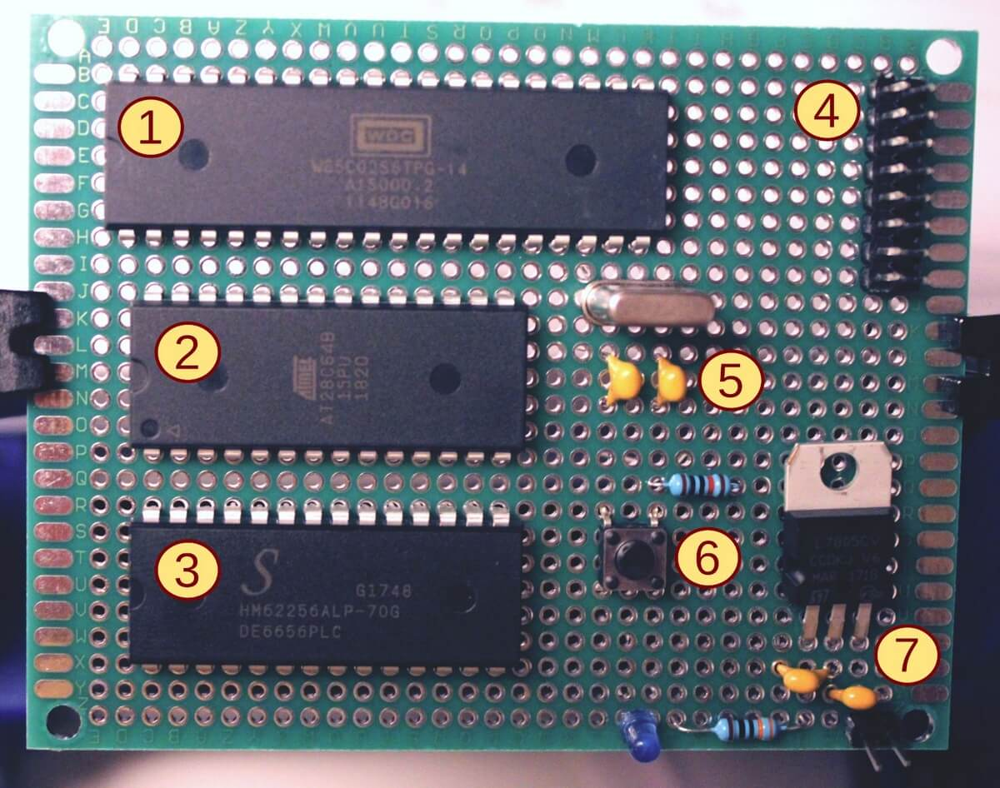

What Makes Up a Computer?
=========================

Almost every computer system consists of the following basic components:

1) Microprocessor
2) Program memory
3) Main memory
4) I/O ports
5) Clock generator
6) Reset switch
7) Power supply
8) Address decoding

Before powerful micro-controllers became available cheaply in large quantities,
embedded computer systems were built discretely from the components shown
here. These components are still partly manufactured and sold today.
