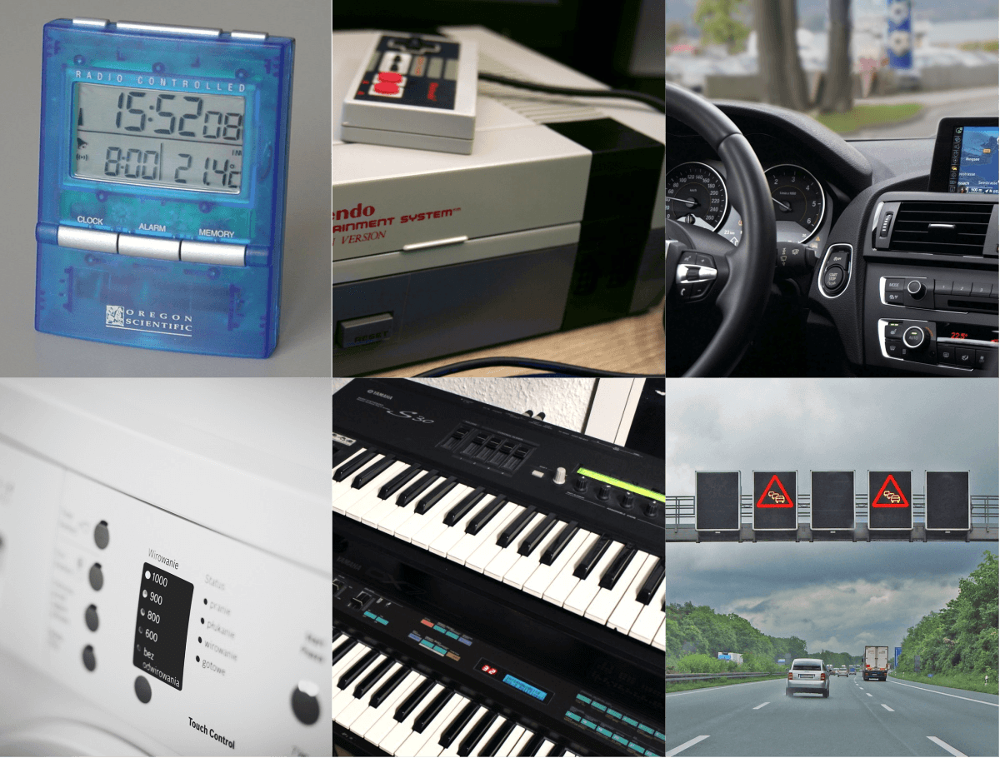

Embedded Systems
================

Embedded systems are small microcomputers installed, usually out of sight,
inside a larger device to control and monitor its functions.

Their basic architecture is the same as that of conventional computers,
but they have far fewer resources, tailored precisely to the use case,
with minimal cost, space requirements, and energy consumption. The guiding
principle is “as much as necessary, as little as possible”.

Embedded systems are usually self-contained systems with deterministic
behavior that run around the clock and perform exactly one task.
