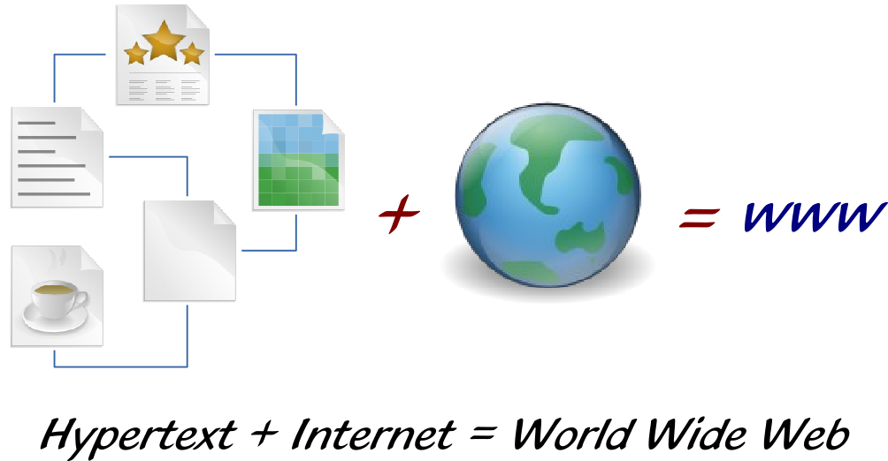

The Idea Behind the World Wide Web
==================================

The preceding pages have given you an idea of the major events in the
development of the Internet. Leonard Kleinrock, one of the Internet's founding
fathers, is right to point out that these things have always happened out of
sight, and their historical significance only became clear afterward.

That was also the case in 1989, when Tim Berners-Lee, a researcher at the
European Organization for Nuclear Research, had an idea. He had already been
working at CERN for some time and had seen that each research group used its own
computer system to document its findings. Since networking was not yet
commonplace, these systems were not connected to one another. So even with
computers, information was still exchanged offline and on paper.

To solve the problem, he imagined a worldwide collection of knowledge that
anyone with a computer could access. A simple access program (what we now call a
"browser") would be all that was needed to retrieve information, publish new
information, and edit what was already there. Sound familiar? In fact, Jimmy
Wales had almost the same idea when he founded Wikipedia. At the time, the idea
that web content should be freely editable had not yet caught on.

In the 1980s, hypertext research was widespread, and several such programs were
available for personal computers (for example, Apple HyperCard). The idea
behind hypertext is simple: the linear format of a book, read from cover to
cover, is not particularly good at conveying complex relationships. The order
in which information is presented in a book is often just one of many possible
ways to organize it. Hypertext therefore moves beyond the linear format and
introduces links, allowing readers to jump to a related topic and continue
reading whenever they like.

Tim Berners-Lee wanted to bring exactly this kind of system to the global
Internet. Until then, people could send and receive email, log in to other
computers, or exchange files over the Internet, but there was no information
system like the World Wide Web. So Berners-Lee sat down and wrote the now-famous
paper "Information Management: A Proposal," which he presented to his employer.
They found the idea quite interesting, but that was as far as it went.

No one could have guessed what would eventually become of the idea. No one
could have imagined it would grow so large that the renowned computer scientist
Joseph Weizenbaum would one day say: "The World Wide Web is a huge pile of
manure with a few pearls in it."
