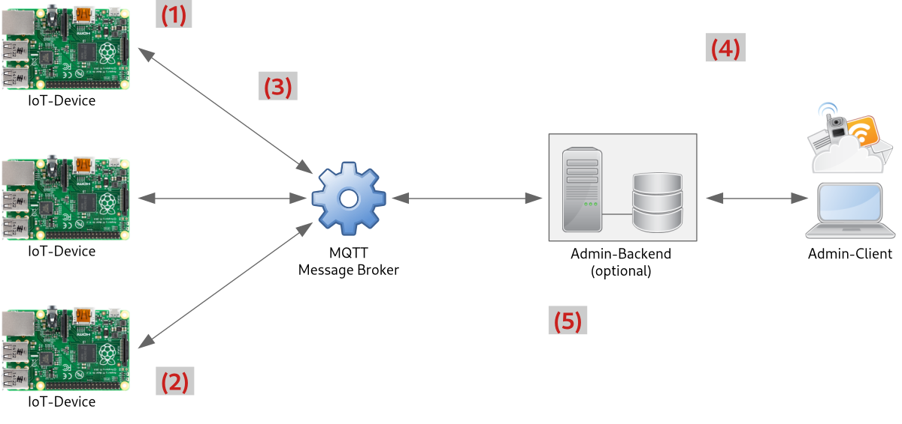

Herleitung der Systemarchitektur
================================

Die folgende Abbildung zeigt die angestrebte Systemarchitektur unseres IoT-Anwendungsfalls:

1) Aufgabenstellung ist die Realisierung eines IoT-Anwendungsfalls auf Basis des Raspberry Pi.

2) Hierfür benötigen wir eine skalierbare Architektur, bei der beliebig viele Devices in Betrieb genommen werden können.

3) Wir nutzen daher einen MQTT-Broker als zentrale Komponente zum Nachrichtenaustausch nach dem Publish/Subscribe-Verfahren.

4) Kommerzielle IoT-Systeme bieten darüber hinaus oft die Möglichkeit, die Devices aus der Ferne zu Überwachen und Steuern.

5) Falls die anfallenden Daten dauerhaft gespeichert und zu einem späteren Zeitpunkt ausgewertet werden sollen, wird hierfür noch eine selbstentwickelte Serverkomponente benötigt. Die Clients könnten dann wahlweise nur auf den Backendserver oder zusätzlich via MQTT auch auf die Devices zugreifen.