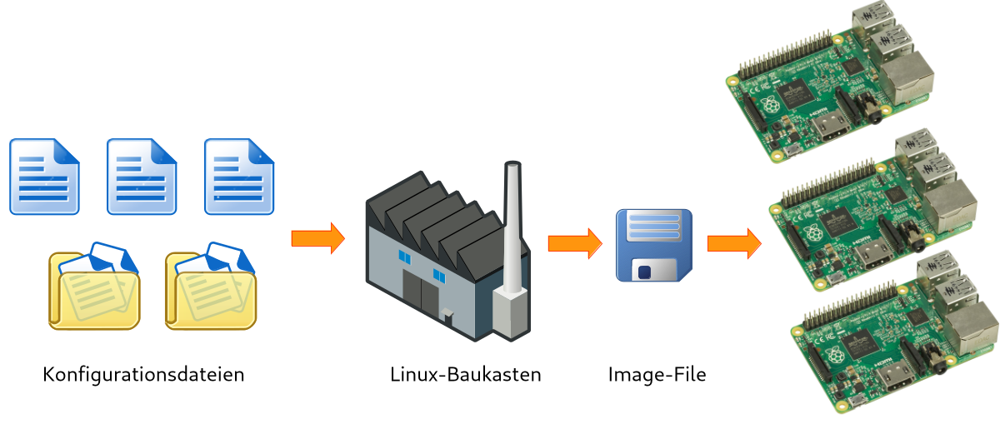

Erstellung der Firmware
=======================

Neben der Programmierung müssen wir eine Lösung finden, wie die Software auf die
Devices kommt und wie neue Devices möglichst einfach in Betrieb genommen werden
können. Idealerweise automatisieren wir dabei möglichst viele Schritte mit Hilfe
einer Remote Device Management Lösung.

Eine Möglichkeit ist, einfach Tastatur, Maus und Bildschirm an den Raspberrry Pi
anzuschließen (oder sich via SSH remote einzuloggen) und das mitgelieferte
Raspbian-System direkt zu modifizieren. Dies bietet sich für das Prototyping an,
lässt sich jedoch nur sehr umständlich automatisieren. Außerdem ist Rasbpian
nicht wirklich ein eingebettetes IoT-Betriebssystem, weshalb es selbst in der
Lite-Variante noch ziemlich groß ist.

Baukastensysteme für Linux wie Buildroot, Yocto, pi-gen oder debootstrap können
hingegen sämtliche Schritte zur Erstellung eines individuellen Linuxsystems
automatisieren. Erweiterte Funktionen wie Remote Device Management oder Remote
Updates müssen dabei jedoch von Hand umgesetzt werden. Dennoch ist diese Option
sehr flexibel und vor allem dann zu empfehlen, wenn die Hardware bestmöglich
ausgereizt werden soll oder ein besonders schlanges System gebaut werden soll.

Eine weitere Alternative ist Balena OS. Der kommerzielle Anbieter Balena bietet
mit Balena OS ein open-source Linux-System für IoT-Devices und mit Balena Cloud
eine vollständig automatisierte Lösung für die Verwaltung von IoT-Devices.
Anwendungen werden in Form von Docker-Containern in die Cloud geschoben und von
dort automatisch auf den Devices deployed. Jedes Device kann über eine
eindeutige URL öffentlich erreichbare Serverdienste bereitstellen.