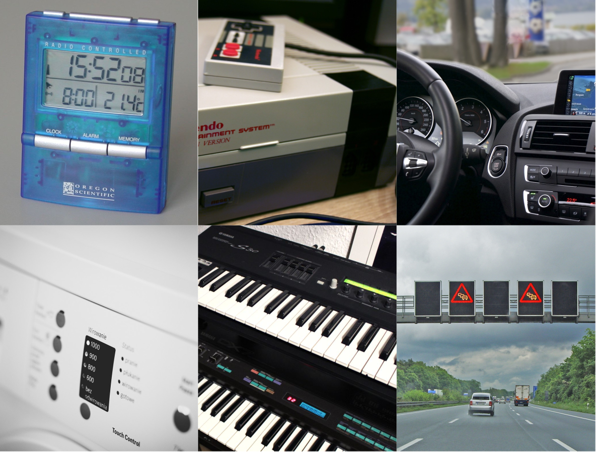

Grundbegriffe des Internet of Things
====================================

Eingebettete Systeme
--------------------

Eingebettete Systeme sind kleine Mikrocomputer, die innerhalb eines größeren
Geräts meist unsichtbar verbaut sind, um seine Funktionen zu steuern und zu
überwachen.

Ihre grundsätzliche Architektur ist dieselbe wie bei konventionellen Computern,
jedoch verfügen sie über weitaus weniger, genau auf den Anwendungsfall
zugeschnittene Ressourcen bei minimalen Kosten, Platzbedarf und
Energieverbrauch. Der Leitgedanke hierbei lautet „so viel wie gerade nötig, so
wenig wie absolut möglich“.

Eingebettete Systeme sind meist in sich geschlossene Systeme mit
deterministischem Systemverhalten, die rund um die Uhr laufen und exakt eine
Aufgabe erfüllen.

Internet of Things
------------------

IoT-Devices sind eingebettete Systeme größerer Leistungsklasse mit
quasi-permanenter Internetverbindung. Die ursprüngliche Definition aus dem Jahr
1999 sah die maschinenlesbare Identifikation physischer Objekte anhand von
RFID-Tags vor. Heute versteht man darunter elektronische Geräte mit
eingebetteten, mit dem Internet verbundenen Computermodulen, die über eine
IP-Adresse weltweit eindeutig adressiert werden können. Im erweiterten Sinne
zählen zum Internet of Things auch Infrastruktur, Cloudplattformen und
Backendservices, über welche die Devices miteinander verbunden, verwaltet,
gesteuert und überwacht werden können.

Das Internet der Dinge (englisch: Internet of Things) gilt als Sammelbegriff für
eine globale IT-Infrastruktur zur Vernetzung physischer und virtueller Objekte
mit dem Ziel, diese zusammenarbeiten zu lassen. Die Idee entstand um das Jahr
1991 in einem Aufsatz von Mark Weiser unter dem Begriff „Ubiquitous Computing“.
Dieser umfasst allgegenwärtige mit Sensoren und ausgestattete Objekte, die
nahtlos in die Umgebung integriert sind und somit nicht mehr direkt als
Computersystem wahrnehmbar sind. Zusätzliche Aktoren erlauben neben der
Erfassung von Zuständen auch die Ausführung von Aktionen.

Die Ursprüngliche Implementierung erfolgte ab der Jahrtausendwende mit an den
Objekten angebrachten, kontaktlos auslesbaren RFID-Tags. Allerdings kann dies
nur als Vorreiter für das Internet der Dinge gesehen werden, da eine Möglichkeit
für die direkte Kommunikation der Objekte über Internetprotokolle fehlt. Heute
umfasst das Internet of Things eine Vielzahl von Technologien, Dienstleistungen
und Geschäftsmodelle. Grundlage hierfür sind:

* Die Standardisierung der Komponenten und Dienste im Internet der Dinge

* Die Einführung einer einfach zugänglichen, sicheren und allgemeinen
  Netzwerkanbindung

* Die Reduktion der Kosten für in das IoT integrierte Teilnehmer

* Die Entwicklung von kostenarmen, automatisierten digitalen Services im
  Netzwerk als Nutzen der Vernetzung.