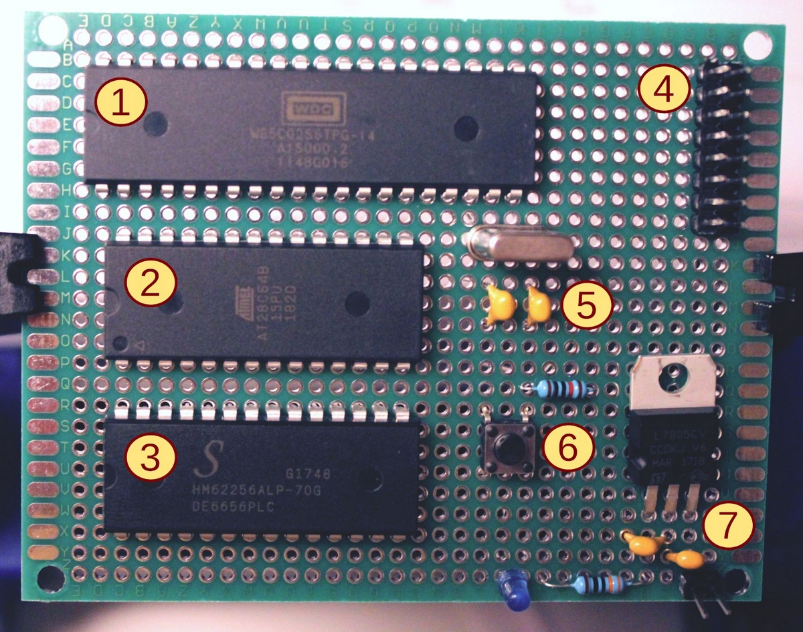

Aus was besteht ein Computer?
=============================

Nahezu jedes Computersystem besteht aus folgenden Grundkomponenten:

1) Mikroprozessor
2) Programmspeicher
3) Hauptspeicher
4) I/O-Ports
5) Taktgeber
6) Resetschalter
7) Stromversorgung
8) Adresskodierung

Bevor leistungsfähige Mikrocontroller in großer Stückzahl günstig zur Verfügung
standen, wurden eingebettete Computersystem aus den hier gezeigten
Grundkomponenten diskret aufgebaut. Die Bausteine werden teilweise heute noch
hergestellt und neu verkauft.