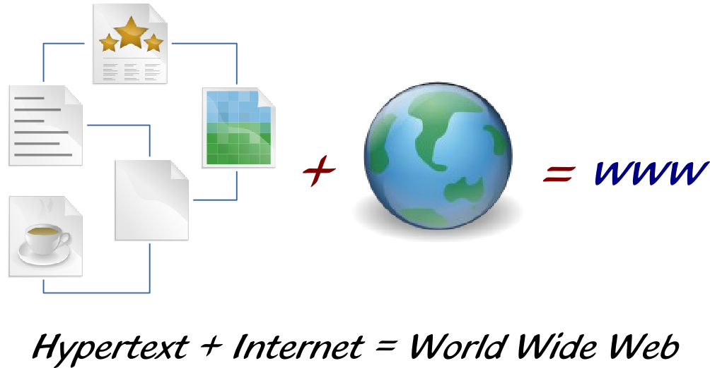

Die Idee hinter dem World Wide Web
==================================

Die vorausgegangenen Seiten haben dir einen Eindruck vermittelt, welche großen
Ereignisse es in der Entwicklung des Internets gegeben hat. Auch wenn Leonard
Kleinrock, einer der Urväter des Internets, zurecht darauf hinweist, dass diese
Dinge immer im Verborgenen geschehen sind und sich die Geschichtsträchtigkeit
immer erst hinterher herausgestellt hat.

So war es auch 1989, als Tim Berners-Lee, einer der Forscher am europäischen
Kernforschungszentrum, eine Idee hatte. Zu dieser Zeit hatte er schon eine Weile
am CERN gearbeitet und er hatte gesehen, dass jede Forschergruppe ihr eigenes
Computersystem nutzte, in dem sie ihre Ergebnisse dokumentierten. Und da das zu
dieser Zeit noch nicht selbstverständlich war, waren die Systeme nicht
miteinander vernetzt. Trotz Computer fand der Informationsaustausch also noch
immer analog und auf Papier statt.

Zur Lösung des Problems stellte er sich eine weltweite Wissenssammlung vor, auf
die jeder mit einem Computer zugreifen könnte. Ein einfaches Zugriffsprogramm
(heute sagen wir „Browser“ dazu) sollte genügen, um die Informationen abzurufen,
eigene Informationen zu veröffentlichen und vorhandene Informationen zu
bearbeiten. Kommt dir irgendwie bekannt vor? Tatsächlich hatte Jim Wales bei der
Gründung von Wikipedia fast die gleiche Idee. Denn die freie Editierbarkeit der
Webinhalte hatte sich damals noch nicht durchgesetzt.

In den 1980ern war die Forschung an sog. Hypertexten weit verbreitet und es gab
auch einige solcher Programme für Personal Computer (vgl. Apple Hypercard). Die
Idee von Hypertexten ist dabei ganz einfach, dass die lineare Form eines Buchs
(von Deckel zu Deckel) eigentlich relativ schlecht darin ist, komplexe
Zusammenhänge zu erfassen. Denn die Reihenfolge, in der die Informationen eines
Buchs präsentiert werden, ist oftmals nur eine von vielen Möglichkeiten, diese
zu strukturieren. Hypertexte verabschieden sich daher von der linearen Form und
führen Verlinkungen ein, so dass der/die Leser*in bei Bedarf einfach an eine
themenverwandte Stelle springen und dort weiter lesen kann.

Und genau so etwas wollte Tim Berners-Lee auf das globale Internet übertragen.
Denn bisher konnte man über das Internet E-Mails senden und empfangen, sich auf
anderen Computern einloggen oder Dateien austauschen, ein Informationssystem wie
das World Wide Web gab es aber noch nicht. Also setzte sich Berners-Lee hin und
schrieb den heute berühmten Aufsatz „Information Management – A Proposal“ und
legte ihn seinem Arbeitgeber vor. Dieser fand die Idee auch durchaus
interessant, dabei blieb es dann aber auch.

Keiner konnte ja damals ahnen, was aus dieser Idee einmal werden würde. Dass sie
einmal soweit kommen würde, dass der bekannte Informatiker Joseph Weizenbaum
einmal sagte: „Das World Wide Web ist ein großer Misthaufen mit ein paar Perlen
drin.“ 